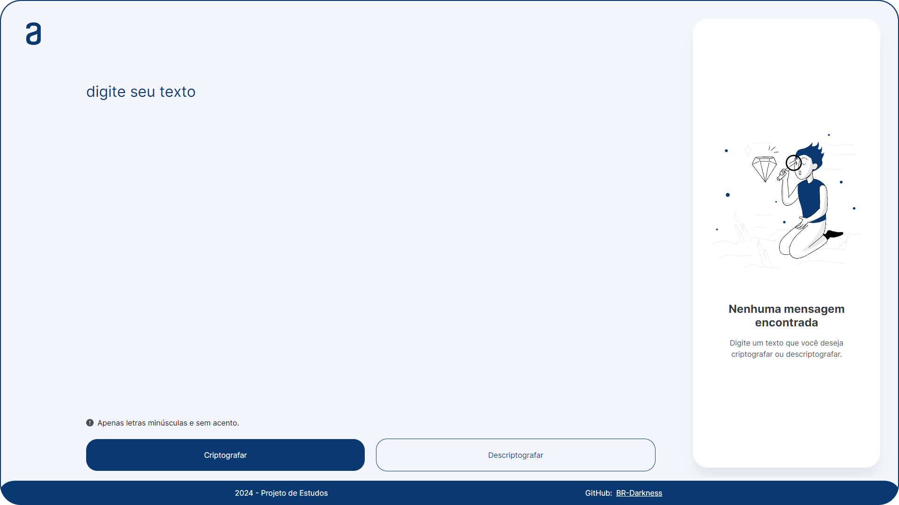
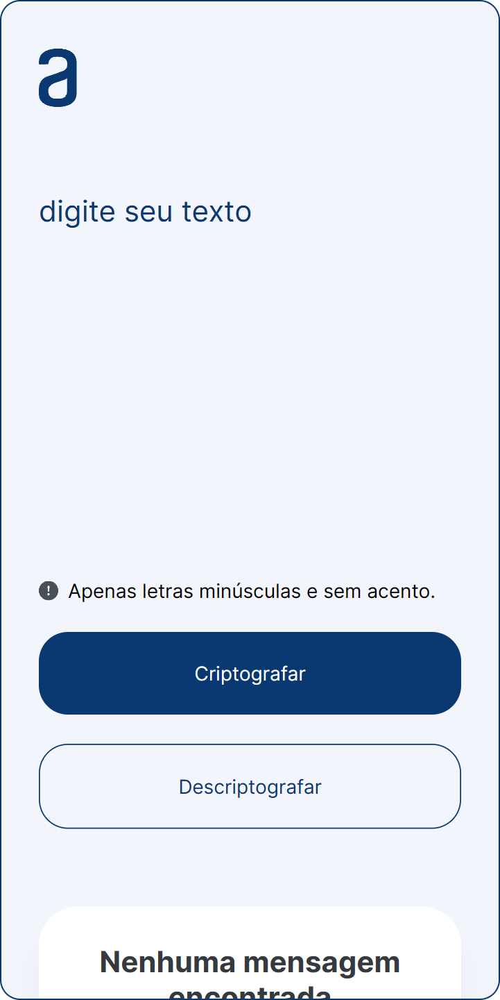

 

<h1 align="center">Projeto: Alura Decodificador</h1>

 

> Codificador e decodificador de textos - desafio Alura.

 

## Sobre o Projeto:

 

<small>Imagem da versão Desktop.</small>

 

Este projeto possui como objetivo o desenvolvimento de um codificador e decodificador de textos proposto como desafio pela Alura.

 

### O que é um decodificador de texto?

 

Um decodificador de textos é uma ferramenta ou algoritmo que converte dados codificados ou cifrados em um formato legível. Ele interpreta sequências de códigos para produzir representações de texto.

Decodificadores de texto são comumente usados em áreas como programação e comunicações de dados, onde a informação precisa ser transformada para transmissão ou armazenamento e depois recuperada em sua forma original.

 

## Requisitos do projeto:

 

As "chaves" de criptografia que utilizaremos são:
- A letra `"e"` é convertida para `"enter"`.
- A letra `"i"` é convertida para `"imes"`.
- A letra `"a"` é convertida para `"ai"`.
- A letra `"o"` é convertida para `"ober"`.
- A letra `"u"` é convertida para `"ufat"`.

### 1. Requisitos:
- Deve funcionar apenas com letras minúsculas
- Não devem ser utilizados letras com acentos nem caracteres especiais
- Deve ser possível converter uma palavra para a versão criptografada e também retornar uma palavra criptografada para a versão original.

    #### Por exemplo:

    `"gato"` => `"gaitober"`  
    `"gaitober"` => `"gato"`

    A página deve ter campos para inserção do texto a ser criptografado ou descriptografado, e a pessoa usuária deve poder escolher entre as duas opções

   **O resultado deve ser exibido na tela.**

### 2. Extras:

- Um botão que copie o texto criptografado/descriptografado para a área de transferência - ou seja, que tenha a mesma funcionalidade do `ctrl+C` ou da opção "copiar" do menu dos aplicativos.

 

## Imagens:

 

<small>Imagem da versão mobile do site</small>

 

## Recursos:

Foram adicionadas algumas funcionalidades ao projeto com intuito de uma melhor experiência do usuário dentre elas:

- Tema claro e escuro da aplicação.
- Botão de copiar texto da tela de resultados.
- Design responsivo e fiel ao figma original.

 

## Links e Referências:

- **Link do projeto:** [Decodificador Alura](https://) 